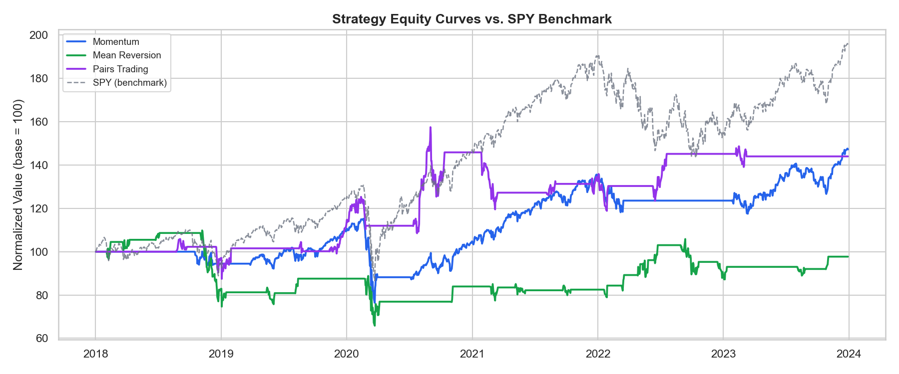
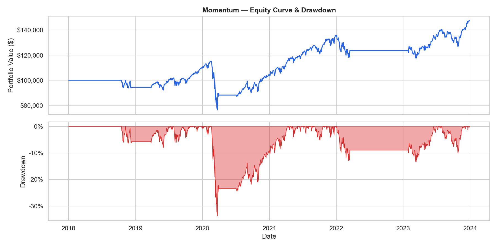
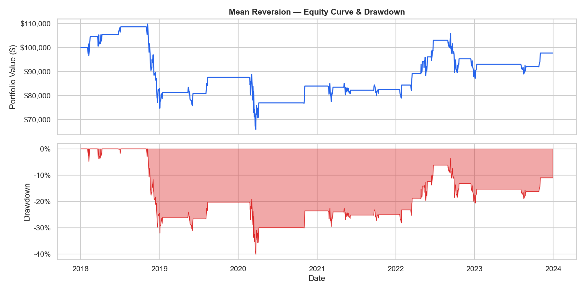
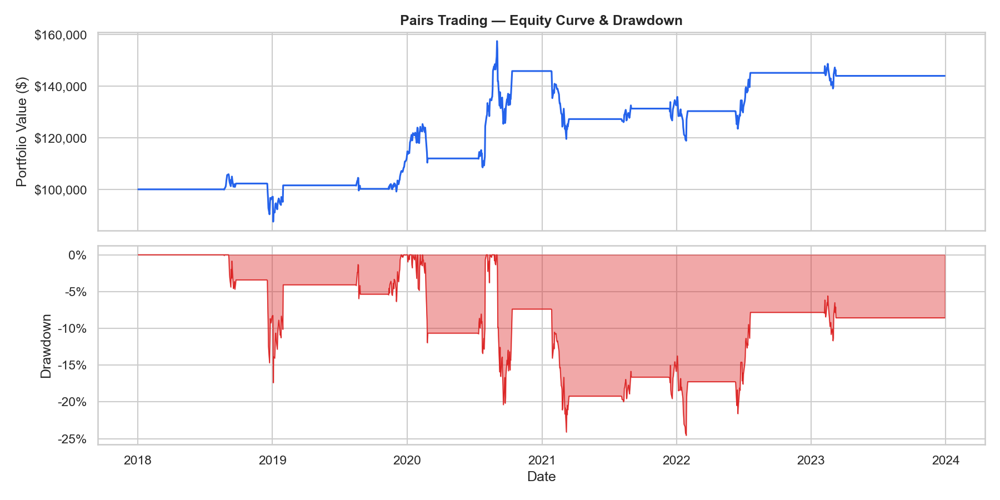
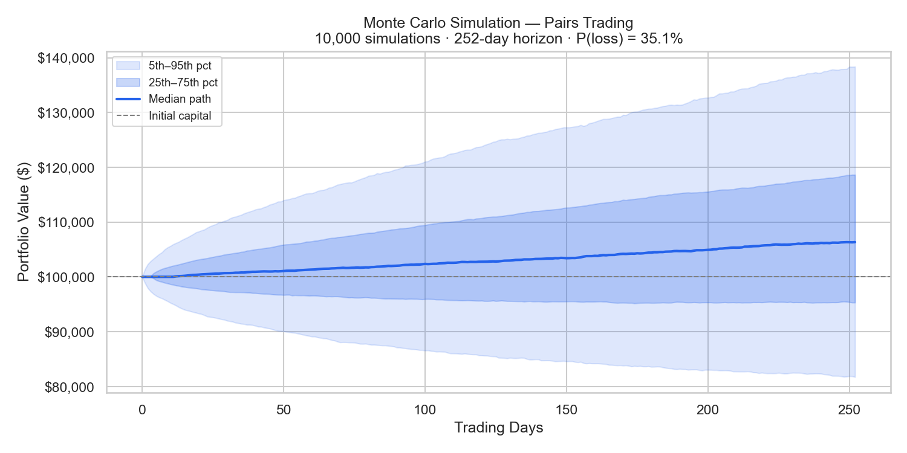

# Quantitative Trading Strategy Backtester

A modular Python framework for evaluating systematic trading strategies with rigorous risk-adjusted metrics, statistical validation, and Monte Carlo stress testing.

**The point of this project is the evaluation methodology, not the absolute return.** It implements three canonical strategies from the quantitative finance literature, benchmarks them honestly against SPY buy-and-hold, and presents the results — including the underperformance — without curve-fitting toward a flattering number.

---

## Headline Results (2018–2023)



| Strategy | Ann. Return | Ann. Volatility | Sharpe | Sortino | Max Drawdown | Calmar | VaR (95%) |
|---|---|---|---|---|---|---|---|
| Momentum (SMA 50/200) | 6.7% | 15.7% | 0.20 | 0.24 | -33.7% | 0.20 | 1.35% |
| Mean Reversion (Bollinger 20/2σ) | -0.4% | 20.1% | -0.14 | -0.20 | -40.1% | -0.01 | 1.38% |
| **Pairs Trading (AAPL/LOW)** | **6.3%** | **16.1%** | **0.18** | **0.26** | **-24.5%** | **0.26** | **1.11%** |
| **SPY (Buy & Hold)** | **11.9%** | **20.4%** | **0.43** | **0.53** | **-33.7%** | **0.35** | **1.96%** |

> Backtest period: Jan 2018 – Dec 2023. Initial capital: $100,000. Transaction costs: 0.1% per trade. Risk-free rate: 4.5%.

### What this table actually says

SPY buy-and-hold beats all three strategies on annualized return and Sharpe — which is the expected result for simple rules-based strategies over a window dominated by a sustained bull market. The academic literature on momentum and mean-reversion strategies consistently shows them adding value in sideways or volatile regimes and lagging in clean trending ones; this backtest reproduces that finding.

The non-obvious result is in the **risk profile**. Pairs trading on the AAPL/LOW spread reduced max drawdown by ~28% versus buy-and-hold (-24.5% vs -33.7%) and had the lowest daily VaR of any strategy tested (1.11% vs 1.96%) — while still capturing about half of SPY's return. On a return-per-unit-of-drawdown basis (Calmar), the gap to SPY narrows from a 1.9× return ratio down to a 1.3× Calmar ratio, suggesting the pairs strategy is doing something real even though it doesn't win outright.

I would want to validate this on out-of-sample data (e.g. 2010–2014 or 2014–2017) before claiming the drawdown reduction is robust rather than an artifact of this specific window.

---

## Why these three strategies

The three strategies are deliberately chosen from the canonical introductory quant finance literature (Chan's *Algorithmic Trading*, López de Prado's *Advances in Financial Machine Learning*) — not because they're profitable in 2018–2023, but because they cover three distinct theoretical regimes any quant evaluation framework needs to handle:

- **Momentum** — trend-following, profits from autocorrelation in returns
- **Mean Reversion** — anti-trend, profits from short-term overreaction in liquid equities
- **Pairs Trading** — market-neutral, profits from cointegration between related assets

Using textbook strategies makes the focus of the project unambiguous: the value is in the framework, the metrics, the statistical validation, and the Monte Carlo machinery — not in claiming to have discovered a novel alpha source.

---

## Strategy Details

### Momentum — Dual SMA Crossover



Long when the 50-day SMA crosses above the 200-day SMA, flat otherwise. Vectorized with `pandas.rolling().mean()`; no shorting. The classic "golden cross / death cross" baseline.

### Mean Reversion — Bollinger Bands



Enters long when price closes more than 2σ below its 20-day rolling mean, exits when price reverts to the mean. Worst-performing strategy in this run — included intentionally as an honest negative example. Mean reversion on a single liquid mega-cap (AAPL) during a strong directional bull market is a textbook regime mismatch, and the result confirms it: -0.4% annualized, -40.1% max drawdown.

### Pairs Trading — Engle-Granger Cointegration



The most statistically involved strategy in the project. Workflow:

1. **Universe screening.** `find_cointegrated_pairs()` tests all pairs in a 12-ticker candidate universe (mega-cap tech, consumer staples, energy, banking, home improvement) using the Engle-Granger two-step cointegration test (`statsmodels.tsa.stattools.coint`).
2. **Pair selection.** Trades only the pair with the lowest p-value below 5% significance. For this run: **AAPL/LOW, p = 0.0152**.
3. **Rolling hedge ratio.** Beta is re-estimated via OLS on a trailing 60-day window at each point in time — *not* the full sample — to avoid look-ahead bias.
4. **Signal generation.** Enters when the spread's rolling z-score drops below -2.0, exits when it reverts to within 0.5 of zero.
5. **Refuse-to-trade safety.** If no candidate pair passes cointegration, the strategy stays flat for the full period rather than trading a spread with no statistical basis.

This last point matters: an earlier version of this strategy hard-coded AAPL/MSFT, which had ADF p = 0.098 (not cointegrated at 5%), and was effectively trading noise. The screening step is the difference between a strategy with a real statistical anchor and one that just happens to produce trade signals.

---

## Risk Framework

Every strategy is evaluated on the full risk-adjusted metric set:

| Metric | What it measures |
|---|---|
| **Sharpe Ratio** | Excess return per unit of total volatility (annualized) |
| **Sortino Ratio** | Excess return per unit of *downside* volatility — penalizes only the bad volatility |
| **Max Drawdown** | Largest peak-to-trough decline in the equity curve |
| **Calmar Ratio** | Annualized return / |max drawdown| — return per unit of worst-case pain |
| **VaR (95%)** | Empirical daily value at risk (5th percentile of daily returns) |

Reporting all five rather than just Sharpe is a deliberate choice — Sharpe alone hides asymmetric return distributions, which mean-reversion strategies in particular tend to have. The Mean Reversion strategy's -0.20 Sortino vs -0.14 Sharpe is a small example: the downside isn't dramatically worse than the upside in this case, but for fat-tailed strategies the gap can be large and informative.

### Monte Carlo Stress Testing



The Monte Carlo module bootstraps observed daily returns 10,000 times to generate alternate equity paths over a 252-day forward horizon. This makes no parametric assumptions about the return distribution — it samples from the empirical one directly.

This is borrowed from actuarial reserve risk modeling: the headline backtest gives a single point estimate, but what you actually want is the *distribution* of plausible outcomes. The module reports:

- **5th / 25th / 50th / 75th / 95th percentile equity paths** (the fan chart)
- **Probability of loss** over the horizon (fraction of paths ending below initial capital)
- **Expected shortfall (CVaR)** — average outcome in the worst 5% of paths

For the pairs strategy, P(loss) over 252 days is **~36%**, with a median 252-day terminal value of ~$106k on $100k starting capital. That's a more honest characterization of the strategy's risk than the single backtest equity curve alone. The simulator uses a fixed random seed by default (`seed=42`), so these figures are reproducible by anyone who clones the repo; pass `seed=None` for fresh randomness.

```python
from risk.monte_carlo import MonteCarloSimulator

# seed=42 by default for reproducible figures; pass seed=None for fresh randomness
mc = MonteCarloSimulator(returns=strategy_returns, n_simulations=10_000, horizon=252)
mc.run()
print(f"P(loss): {mc.prob_of_loss():.1%}")
print(f"Expected shortfall (95%): {mc.expected_shortfall():.2%}")
mc.plot_fan_chart(save_path="results/fan_chart.png")
```

---

## Project Structure

```
quant-backtester/
├── engine/
│   ├── backtester.py        # Core event-driven backtesting loop
│   ├── portfolio.py         # Position tracking, P&L, equity curve
│   └── data_loader.py       # Historical data fetching + parquet caching (yfinance)
├── strategies/
│   ├── base_strategy.py     # Abstract Strategy interface (ABC)
│   ├── momentum.py          # Dual SMA crossover
│   ├── mean_reversion.py    # Bollinger Band mean reversion
│   └── pairs_trading.py     # Engle-Granger cointegration screening + rolling hedge ratio
├── risk/
│   ├── metrics.py           # Sharpe, Sortino, Calmar, MDD, VaR, annualized return/vol
│   └── monte_carlo.py       # Bootstrap stress testing + fan charts
├── visualization/
│   └── plots.py             # Equity curves, drawdown plots, return distributions
├── tests/
│   ├── test_engine.py       # 15 tests: portfolio, backtester, all three strategies
│   └── test_metrics.py      # 8 tests: every risk metric incl. edge cases
├── results/                 # Auto-generated plots + CSV summary
├── main.py                  # Entry point
├── config.py                # All tunable parameters in one place
└── requirements.txt
```

Separation of concerns is deliberate: adding a fourth strategy requires writing exactly one new file (`strategies/my_strategy.py`) that implements `BaseStrategy.generate_signals()`, with no changes to the engine, portfolio, metrics, or visualization layers.

---

## Quickstart

```bash
# Clone and install
git clone https://github.com/psalarc/quant-backtester.git
cd quant-backtester
pip install -r requirements.txt

# Run all three strategies + benchmark + Monte Carlo
python main.py

# Run a single strategy
python main.py --strategy momentum --start 2018-01-01 --end 2023-12-31

# Run the test suite (23 tests)
pytest tests/ -v
```

All outputs (equity curve plots, drawdown charts, return distributions, Monte Carlo fan charts, and a CSV performance summary) are saved to `results/`.

---

## Testing

```
$ pytest tests/ -v
================ 23 passed in 3.54s ================
```

The test suite covers:
- **Portfolio accounting** — initial equity, buy/sell transitions, transaction cost impact, trade count
- **Strategy logic** — signal correctness on synthetic price processes (drifting GBM for momentum, Ornstein-Uhlenbeck for mean reversion, constructed cointegrated pairs for pairs trading)
- **Risk metrics** — known-answer tests for max drawdown, edge cases for zero-volatility returns, VaR sign convention
- **Cointegration screening** — confirms the screener identifies genuinely cointegrated pairs and refuses to trade independent random walks

Tests intentionally do not hit the live Yahoo Finance API — strategy logic is validated against synthetic processes with known statistical properties, which both makes tests fast/reproducible and proves the strategy code is correct independent of any specific market data.

---

## Tech Stack

| Layer | Tools |
|---|---|
| Language | Python 3.10+ |
| Data | `yfinance`, `pandas`, `numpy`, `pyarrow` (parquet caching) |
| Statistics | `statsmodels` (cointegration, ADF, OLS), `scipy` |
| Visualization | `matplotlib`, `seaborn` |
| Testing | `pytest` |

---

## Honest Limitations

This is a research backtester, not a production trading system. Specific things it does **not** model:

- **Slippage** beyond a flat 0.1% transaction cost. Real execution can be much worse, especially for size or in less-liquid names.
- **Survivorship bias.** The 12-ticker pairs universe contains only currently-listed large caps. Any pair that delisted, merged, or restructured during the period is invisible.
- **Order book / execution latency.** All trades fill at the daily close mid. No partial fills, no rejected orders.
- **Out-of-sample validation.** Everything reported is in-sample on the 2018–2023 window. The cointegration screening uses the full sample, which itself contains a mild look-ahead concern even though the hedge ratio is rolling.
- **Position sizing.** The portfolio invests fully (cash → 100% long or 100% flat). No volatility targeting, no Kelly sizing, no risk parity.
- **Short selling and dollar-neutrality.** Pairs trading trades the spread as a synthetic long-only asset rather than going long A / short β-units of B, which would be the correct dollar-neutral implementation in practice.

Each of these would be a natural next step. The framework is structured so adding them touches a single module rather than the whole codebase.

---

## What I'd do next

In rough order of impact on result credibility, not difficulty:

1. **Out-of-sample validation** — re-run on 2010–2014 and 2014–2017 to test whether the pairs-trading drawdown advantage replicates or is window-specific.
2. **Walk-forward cointegration screening** — re-screen the pairs universe every quarter and reallocate to the most cointegrated pair, instead of selecting once on the full sample.
3. **Proper dollar-neutral pairs implementation** — long A / short β·B with explicit hedge sizing, instead of trading the spread as a synthetic single asset.
4. **Volatility targeting** — scale position size inversely with realized volatility to stabilize the strategy's risk profile across regimes.
5. **Multi-asset momentum** — extend SMA crossover across a basket (SPY, QQQ, IWM, EFA, EEM) with cross-sectional ranking, which is closer to how trend-following is implemented in practice.

---

## Author

**Pablo Salar Carrera**
M.S. Data Science (NJIT, 3.85 GPA, *summa cum laude*) · B.A. Mathematics & Actuarial Science (Rider University, 3.82 GPA, *summa cum laude*) · ACM-published in ML healthcare diagnostics

[LinkedIn](https://www.linkedin.com/in/pablo-salar-carrera-11394315b/) · [GitHub](https://github.com/psalarc) · [psalarc@gmail.com](mailto:psalarc@gmail.com)

The Monte Carlo stress testing module is intentionally borrowed from actuarial reserve risk modeling — bootstrapping the empirical return distribution to characterize tail risk is the same conceptual tool used to estimate reserve adequacy under stochastic claims experience.
